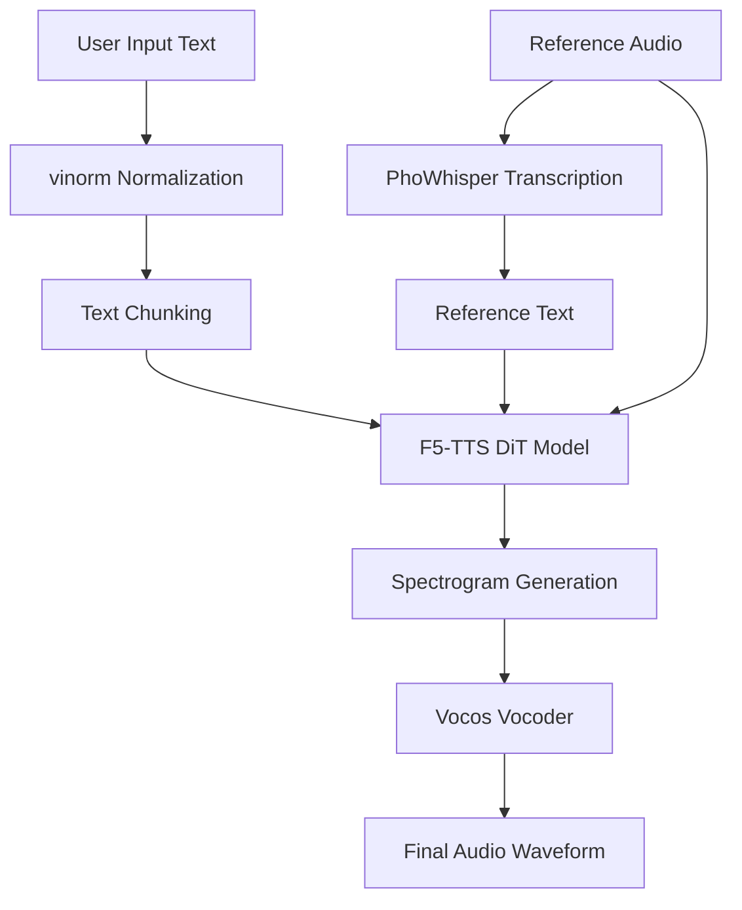

# F5-TTS Vietnamese Project Documentation

Detailed guide for using and understanding the F5-TTS Vietnamese Text-to-Speech system.

## 1. Project Overview

F5-TTS Vietnamese is a specialized implementation of the F5-TTS architecture, optimized for the Vietnamese language. It features a DiT (Diffusion Transformer) model trained on 1000+ hours of high-quality Vietnamese speech data.

### Key Features:
- **Zero-shot Voice Cloning**: Clone any Vietnamese voice with just a 10-15s sample.
- **Advanced Text Normalization**: Integrated with `vinorm` and `underthesea` to handle numbers, dates, and complex Vietnamese typography.
- **Improved Windows Stability**: Custom audio loading and binary-free text normalization for reliable Windows operation.
- **GPU Optimized**: Full support for NVIDIA CUDA acceleration.

---

## 2. Installation & Setup

### Prerequisites:
- Python 3.12 (Recommended)
- NVIDIA GPU with 8GB+ VRAM (for GPU acceleration)

### Steps:
1. **Clone the repository**:
   ```bash
   git clone <repository_url>
   cd F5-TTS-Vietnamese-100h
   ```

2. **Create a Virtual Environment**:
   ```bash
   python -m venv venv
   .\venv\Scripts\activate
   ```

3. **Install Dependencies**:
   ```bash
   pip install -r requirements.txt
   # For GPU support (CUDA 12.1):
   pip install torch torchaudio --index-url https://download.pytorch.org/whl/cu121
   ```

4. **Install Windows Fallback Libraries**:
   ```bash
   pip install underthesea vietnam-number
   ```

---

## 3. Usage Guide

Run the application:
```bash
python app.py
```
The interface will be available at `http://127.0.0.1:7860`.

### UI Components:
- **Quick Select Sample**: Automatically lists audio files found in the `samples/` folder.
- **Sample Voice (Audio Reference)**: Upload a 10-15s clear audio clip of the target voice.
- **Sample Voice Text (Optional)**: Provide the exact text spoken in the reference audio to improve cloning accuracy. If left empty, the system uses **PhoWhisper** for automatic transcription.

### Managing Your Own Samples:
To avoid re-entering text for your favorite voice samples:
1. The app automatically creates a `samples` folder with `wavs` and `txt` subfolders.
2. Put your audio file in `samples/wavs/` (e.g., `my_voice.wav`).
3. Create a text file with the **exact same name** in `samples/txt/` (e.g., `my_voice.txt`).
4. Write the transcription of the audio inside the `.txt` file.
5. Restart the app or refresh the page to see it in the dropdown. Selecting it will automatically load both the audio and the text.

---

## 4. Technical Architecture

### Workflow Diagram:


### Core Components:
- **DiT Model**: Processes text and reference audio latent features to generate a mel-spectrogram.
- **Vocos**: A fast, high-quality vocoder that reconstructs the audio waveform from the generated spectrogram.
- **vinorm (Customized)**: Patched to run purely in Python on Windows, converting "123" to "một trăm hai mươi ba".

---

## 5. Optimized Features for Vietnamese

### Custom Text Normalization (vinorm Patch)
The original `vinorm` relies on a Linux binary. We implemented a **Pure Python Fallback** that detects Windows systems and uses `underthesea` and `vietnam-number` to ensure:
- Dates like "01/01/2024" -> "ngày một tháng một năm hai nghìn không trăm hai mươi tư".
- Numbers are correctly spelled out.
- Vietnamese Unicode characters are handled without encoding crashes.

### Intelligent Text Chunking
Long inputs are automatically split using `chunk_text` logic in `utils_infer.py`:
- Spilt by sentence and comma boundaries.
- Merges very short phrases to prevent "choppy" speech.
- Maintains a consistent rhythm throughout long paragraphs.

---

## 6. Troubleshooting

| Issue | Solution |
|-------|----------|
| `WinError 193` | Ensure `underthesea` and `vietnam-number` are installed. The system will auto-fallback. |
| `UnicodeEncodeError` | The project is patched for UTF-8. Ensure your console and text files are saved in UTF-8. |
| Slow Inference | Check if GPU acceleration is active (`Device: cuda` in logs). |
| Poor Voice Quality | Use a clearer, dryer reference audio with no background noise. |

---

## 7. Credits
- Model by: `hynt`
- Architecture: F5-TTS
- Normalization: `vinorm` & `underthesea`
